<div style="background: #136DBC; width: 100%; height: 480px; display: flex; align-items: center; justify-content: center">

</div>

<div align="center">
  <br />
  <h1>Google Calender App</h1>
  <a href="https://support.deskpro.com/ga/guides/developers/anatomy-of-an-app" target="_blank">Deskpro Apps Documentation</a>
  <span>&nbsp;&nbsp;•&nbsp;&nbsp;</span>
  <a href="https://developers.google.com/workspace/calendar/api/guides/overview" target="_blank">Google Calendar API Documentation</a>
  <span>&nbsp;&nbsp;•&nbsp;&nbsp;</span>
  <a href="./SETUP.md" target="_blank">Google Calendar App Setup Guide</a>
  <br />
  <hr />
  <br />
</div>


## **About the app**
Google Calendar provides time management and scheduling for users to create, manage, and share calendars, events, and reminders.
Synchronize your scheduling directly from the Deskpro platform, enhancing your help desk's efficiency.

## **Setting up the app in Deskpro**
You can follow our [setup guide](./SETUP.md) for a step-by-step guide to setting up the Google Calendar app in Deskpro.


## **Development**
This app was developed primarily using **Typescript**, **React**, and **Vite**.
We recommend using [PNPM](https://pnpm.io/) to manage this project.

### **Setup**
To run this project locally:

Clone the repository
 ```bash
 git clone https://github.com/DeskproApps/google-calendar.git
   ```
Change to the project directory:

```bash
cd google-calendar
 ```

Install dependencies
```bash
pnpm install
```

Then, run the development server.

```bash
pnpm start
```

You should now be able to view the app in your browser. For more information about developing Deskpro apps, [Visit the docs](https://support.deskpro.com/ga/guides/developers/anatomy-of-an-app).

### **Testing**
We've included `jest` to run your tests. It will look anywhere in `/src` for test suite files ending in `.test.tsx` or `.test.ts`.

You can run all tests using:

```bash
pnpm test
```

## **Development with DevContainers (Recommended)**

To make development easier and avoid version conflicts, we recommend using **DevContainers** for local development. This approach ensures that everyone on the team uses the same environment, reducing setup issues and version mismatches between dependencies.

### **Why use DevContainers?**
- **Consistency:** All developers work in the same environment, with the same versions of dependencies, tools, and configurations.
- **Speed:** The DevContainer setup is quick to start, letting you focus on coding rather than environment setup.
- **Isolation:** Avoid conflicts between different versions of Node.js, PNPM, or other dependencies by using the predefined container setup.

### **Getting Started with DevContainers**
1. Ensure that you have [Docker](https://www.docker.com/get-started) and [VS Code](https://code.visualstudio.com/) installed.
2. Open the project in VS Code.
3. If you have the **Remote - Containers** extension installed, VS Code should automatically detect the `.devcontainer` configuration in this project and prompt you to reopen the folder in the container.
4. After opening the project in the DevContainer, run:
   ```bash
   pnpm install

## **Versioning**
Every app deployment requires that the version property in the `manifest.json` file be updated to reflect the new app version. This is so Deskpro can detect changes and add/upgrade apps accordingly. As such, we've made altering versions easy by having CI make the actual version change for you. Here's what we do:

* We increment patch versions, i.e. 1.0.1, automatically. You don't need to do anything and this will happen
* Minor versions, i.e. 1.1.0, are incremented if you add the minor-version GitHub label to your PR
* Major versions, i.e. 2.0.0, are incremented if you add the major-version GitHub label to your PR